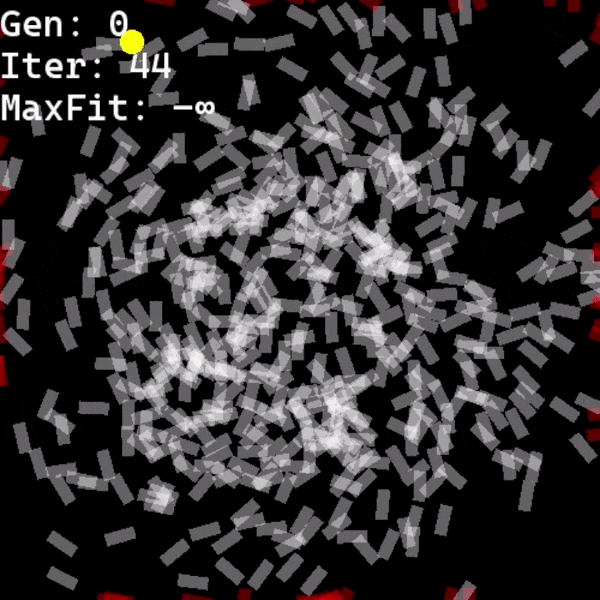

# SmartRockets: Genetic Algorithm Visualization



## Overview

SmartRockets is a genetic algorithm visualization that demonstrates the concept of survival of the fittest. The program is inspired by the Coding Train and implemented from scratch using C# and the custom graphics library "Krane," available in the [Krane repository](https://github.com/kerodkibatu/krane).

## Table of Contents
- [Overview](#overview)
- [Features](#features)
- [Installation](#installation)
- [Usage](#usage)
- [Custom Graphics Library: Krane](#custom-graphics-library-krane)
- [Contributing](#contributing)

## Features

- Genetic algorithm simulation
- Visualization of rockets evolving over generations
- Effectively demonstrate Survival of the fittest concept
- Customizable parameters for experimentation
  
## Installation

1. Clone the SmartRockets repository:

   ```bash
   git clone https://github.com/kerodkibatu/smartrockets.git
   ```

2. Navigate to the project directory:

   ```bash
   cd smartrockets
   ```

3. Build and run the project using your preferred C# development environment.

## Usage

1. Open the SmartRockets project in your C# development environment.
2. Adjust the parameters in the code to customize the genetic algorithm's behavior.
3. Run the program to visualize the SmartRockets genetic algorithm.

```csharp
// Example: Adjust population size
int populationSize = 100;

// Example: Tweak mutation rate
float mutationRate = 0.01f;
```

## Custom Graphics Library: Krane

The graphics library Krane, also developed by me, is used to create visualizations in SmartRockets. For more details and documentation, refer to the [Krane repository](https://github.com/kerodkibatu/krane).

## Contributing

If you would like to contribute to SmartRockets, feel free to submit pull requests, report issues, or suggest enhancements. Contributions are always welcome!
